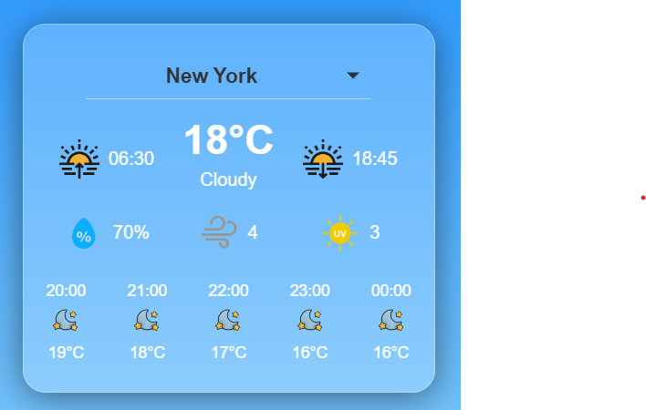

# Weather Widget Project

## Overview

This project is a simple weather widget built using Angular 18. It showcases the use of Angular signals with mocked data to display weather information for various cities. The widget is visually appealing, featuring a modern design with a semi-transparent glass effect and a smooth gradient background. 



The image above illustrates the widget, centered on the page, providing a glimpse of how the weather data is presented.

## Features

- **Angular 18**: The project is built using Angular version 18, taking advantage of its latest features and performance improvements.
- **Angular Signals**: The application demonstrates the use of Angular signals to manage reactive data flows within the widget.
- **Mocked Data**: The weather information is generated using mocked data, allowing you to see how the widget behaves without needing a live API.
- **Responsive Design**: The widget is fully responsive, ensuring it looks great on both desktop and mobile devices.
- **Glassmorphism Style**: The design includes a semi-transparent, blurred background for a modern and sleek look.

## Installation

To set up and run this project locally, follow these steps:

1. **Clone the repository**:
   ```bash
   git clone https://github.com/yourusername/weather-widget.git
   cd weather-widget
   ```

2. **Install dependencies**:
   Ensure you have Node.js installed, then run:
   ```bash
   npm install
   ```

3. **Run the application**:
   To start the Angular development server, use:
   ```bash
   ng serve
   ```
   The application will be available at `http://localhost:4200/`.

## Usage

Once the application is running, you can interact with the weather widget to view weather information for various cities. The data displayed is based on mocked weather data, showcasing the functionality of the widget.

## Customization

You can customize the mocked data and the design of the widget according to your needs:

- **Mock Data**: Located in the `src/mock` directory. Modify this data to change the cities and weather conditions displayed in the widget.
- **Styling**: The CSS styles are located in the `src/global_styles.css` file. You can adjust the styles to match your preferred design.

## License

This project is open-source and available under the [MIT License](LICENSE).

